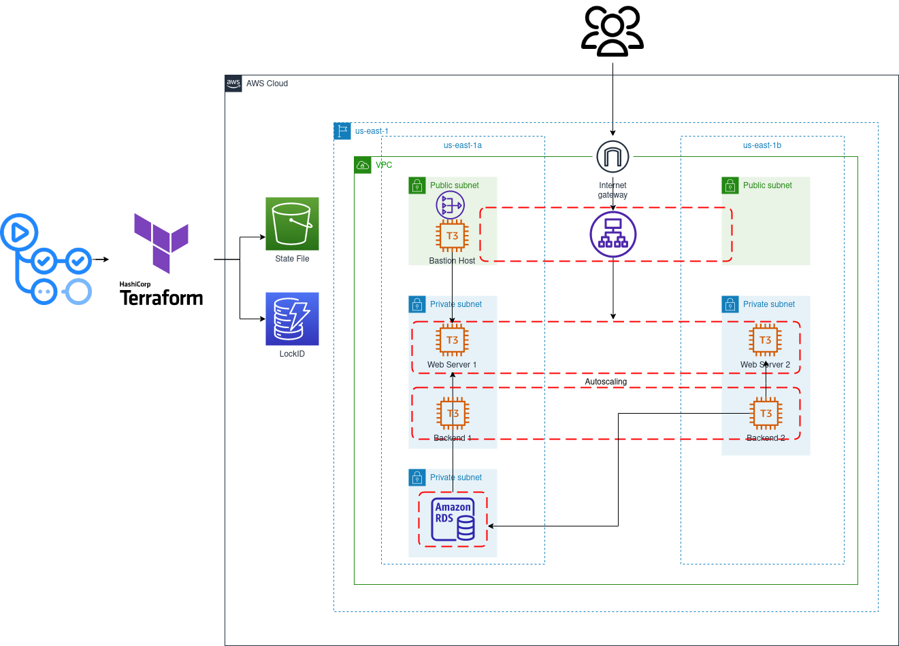

# Infrastructure Documentation

This document provides an overview of the infrastructure setup for the "three-tier-cdk" project using AWS CDK. It includes details about the architecture, resources created, and step-by-step instructions on how to reproduce this infrastructure.


## Overview: 3-Tier Architecture and Information Flow
The infrastructure embraces a 3-tier architecture that ensures a clear and secure information flow while promoting isolation between different components. Here's how information flows within this setup:

### Tier 1: Amazon Virtual Private Cloud (VPC) with Public Subnets, ALB
#### Public Subnets

#### Information Flow:
- Public subnets host resources such as Load Balancers, providing a secure entry point for incoming user traffic.
- Load Balancers distribute incoming requests to backend instances, which is located in the private subnets of Tier 2.

#### Importance:
- Public subnets are exposed to the internet and provide an entry point for external user requests.
- They create a secure demilitarized zone (DMZ) for handling incoming traffic.

### Tier 2: EC2 Application Instances, and Worker Nodes
#### Information Flow:

- The EC2 ASG, including application instances and Web frontend instances, are hosted within private subnets.
- EC2 instances accessed by administrators and developers via a Bastion Host located in the public subnet.

#### Importance:
- Private subnets are not exposed to the internet and access between backend and frontend instances and ALB are secured by security group configurations

### Tier 3: Amazon Relational Database Service (RDS) for MySQL
#### Information Flow:

- The RDS instance, which stores application data, resides in a private subnet.
- It can only be accessed by application instances in the same private subnet or authorized users connecting via the Bastion Host located in the public subnet.

#### Importance:
- The RDS instance is shielded from external access, ensuring data security and compliance.
- It provides a trusted repository for application data, with controlled access through a secure channel.

### Secure Access via Bastion Host
#### Information Flow:

- Authorized users, including administrators and developers, connect to the Bastion Host in the public subnet.
- The Bastion Host serves as a gateway, allowing secure, controlled access to the EC2 private instances.

#### Importance:
- The Bastion Host enforces secure access policies, ensuring that only authorized personnel can reach private resources like the EC2 and RDS instance.
- It logs access activities for auditing and monitoring purposes, enhancing security and accountability.

In this revised architecture, both application instances and frontend instances are placed in Tier 2, as they reside in private subnets. The Bastion Host and Load Balancers are located in public subnets, serving as the primary entry points for external user traffic and providing secure access to the EC2 and other private resources.


## Project Folder Structure
The project's folder structure is organized to maintain separation between infrastructure provisioning and state management. Here's an overview of the key components:

```
├── AWS-Three-Tier-Architecture.drawio.png
├── cdk-3tier
│   ├── app.py
│   ├── cdk.json
│   ├── cdk.out
│   ├── requirements.txt
│   ├── setup.py
│   └── stacks
│       ├── alb_backend_stack.py
│       ├── alb_frontend_stack.py
│       ├── bastion_stack.py
│       ├── __init__.py
│       ├── __pycache__
│       │   ├── alb_backend_stack.cpython-310.pyc
│       │   ├── alb_frontend_stack.cpython-310.pyc
│       │   ├── bastion_stack.cpython-310.pyc
│       │   ├── __init__.cpython-310.pyc
│       │   ├── rds_stack.cpython-310.pyc
│       │   ├── security_stack.cpython-310.pyc
│       │   └── vpc_stack.cpython-310.pyc
│       ├── rds_stack.py
│       ├── resources
│       │   ├── __init__.py
│       │   ├── nat_gateway.py
│       │   ├── route.py
│       │   ├── subnet.py
│       │   └── vpc.py
│       ├── scripts
│       │   ├── install_httpd.sh
│       │   └── install_node.sh
│       ├── security_stack.py
│       └── vpc_stack.py
├── README.md
```

1. ### docs
   - ####     
       A visual representation of the infrastructure diagram.
   - #### Infrastructure-setup:
       ```bash
       $ cd cdk-3tier
       $ cdk ls
       $ cdk synth
       $ cdk deploy --all
       ```


# Assumptions, Design Choices, and Additional Considerations

1. ## Multi-Availability Zone (AZ) Deployment
   #### Design Choice: 
   The infrastructure is designed to be deployed across multiple Availability Zones (AZs) for high availability and fault tolerance. This choice ensures that if one AZ experiences an issue, the application can continue to operate from the other AZ.

   #### Consideration: 
   Although this design choice increases availability, it may result in higher infrastructure costs. However, it aligns with best practices for critical production workloads.

2. ## Private Subnets for Databases
   ### Design Choice: 
   The MySQL database instances are deployed in private subnets, isolating them from direct internet access. This enhances security by reducing the database's exposure to potential threats.

   #### Consideration: 
   Access to the database is allowed through a Bastion Host for authorized users. This approach adds an additional layer of security but may require more complex access management.

3. ## Bastion Host for Secure Access
   #### Design Choice: 
   A Bastion Host is implemented to provide secure access to resources in private subnets. Users must first access the Bastion Host and then use it as a jump server to reach other instances.

   #### Consideration: 
   While this design adds security, it also introduces an extra step for users accessing the application. Proper access control and monitoring on the Bastion Host are essential.

4. ## EC2 instances for web frontend and backend
   #### Design Choice: 
   The Amazon EC2 ASG is deployed in a private subnet to limit direct access to the instances. Bastion Host is used for administrative access to the instances.

   #### Consideration: 
   This choice improves security but necessitates a robust access control policy for instance management.

5. ## Load Balancer as Entry Point
   #### Design Choice: 
   The application is exposed to users through a Load Balancer (LB) in a public subnet, acting as the entry point. This design enhances scalability and distributes traffic evenly.

   #### Consideration: 
   Careful configuration and monitoring of the LB are crucial to ensure availability.
